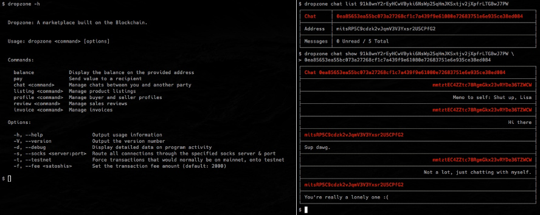

#dropzone-lib 
[](https://travis-ci.org/ScroogeMcDuckButWithBitcoin/dropzone-lib)

An Anonymous Peer-To-Peer Local Contraband Marketplace built with Bitcoin. [Read the White Paper](Drop Zone - Whitepaper.pdf)

## Getting Started in your Web Browser
TODO: 

## Getting Started in node

Before you begin you'll need to have Node.js v0.12 installed. There are several options for installation. One method is to use [nvm](https://github.com/creationix/nvm) to easily switch between different versions, or download directly from [Node.js](https://nodejs.org/).

```bash
npm install -g bitcore
```

## Using dropzone-lib
TODO: Create a transaction:
```js
var bitcore = require('bitcore');
var transaction = new bitcore.Transaction();
var transaction.from(unspent).to(address, amount);
transaction.sign(privateKey);
```

## Author's Manifesto


To whom it may concern,

Markets are objects of censorship and always have been.  There is a presumed 
division, that renders commerce distinct from the notion of free speech.  But I 
will allege that the act of commerce is, itself, indistinct from speech.  Where 
or how one spends their value is a decision as personal and poignant as any 
words ever spoken or letters ever written.

As a unfortunate consequence of freedom, bad actors will engage in repugnant 
trade that impinges upon the rights and freedoms of others.  It is the job of 
humanity to cooperate and see to it that trade, such as this, becomes 
unprofitable.  Whether it is accomplished through technological achievement or 
through the adjustment of social mores, or perhaps a simple appeal to the 
underlying natural law, it is not the job of bad acting third parties to force 
into hiding commerce that must be dealt with by means of an adjustment to the 
global, social conscience.

Cooperation, in the manner I was just speaking about, has never been plausible 
until the invention of The Blockchain.  I will not foist upon Satoshi's humble 
creation such impracticable possibilities as the achievement of world peace.  
But in approaching Drop Zone, I am attempting to do nothing more than what is 
possible and possibly more efficient than what exists.  I wish for Drop Zone 
to be nothing more than an appendage to The Blockchain.  As such, it is every 
bit as much Bitcoin as Bitcoin itself.  Just as a fungible Bitcoin enables the 
exchange of spaceless value with near impunity, Drop Zone removes the ability 
of unwelcome parties from glancing over the shoulders of those in the act of an 
exchange, whatever it entails.  This technology disrupts the ability of buyers 
to gain insight into the identities or movements of suppliers making supply 
chains far less vulnerable to disruption.  It is this innovation that separates 
this project from all other decentralized market solutions.

Whereas Bitcoin forces us to consider the nature of money and value, Drop Zone 
will do the same for commerce.  At its root, Bitcoin is a message passing 
system.  Those messages that are passed, unlike any electronic message that's 
come before it, articulate value.  Commerce is, and has always been, similarly 
inclined toward message passing.  Whether in-person, over email, or through 
large, online shopping carts, fundamentally, commerce is composed of messages 
that are in service of the transaction wherein a final message of value is sent 
to a recipient in exchange for a negotiated good or service.  As such, Drop 
Zone is a secure message passing protocol inasmuch as it is a platform for 
commerce.  And while the problem is far beyond the scope or capabilities of 
the protocol in its most fundamental form, the observant might even see the 
tenuous skeleton of a full-fledged reputation system.  Such a project is, in 
itself, as important and difficult as any facing this decentralized ecosystem.

I hope that Drop Zone lets us all dream of a day when no man will any longer be 
made to suffer indignity for simply engaging in unpopular or stigmatized 
commerce.  May all commerce be created equal.

Today is a Beautiful day,

__Miracle Max__
__quia omnis qui se exaltat humiliabitur et qui se humiliat exaltabitur__

## Errata
  * The white paper expressed 8 digits of precision for the listing radius. This implementation instead uses 6 digits. If additional precision is later deemed necessary, a field can be added to the listing to accomodate enhanced precision
  * The white paper expressed pkeys (addresses) as being encoded ints. These are instead encoded as variable length strings.
  * The white paper expressed transaction ids as being encoded ints. These are instead encoded as variable length strings.

